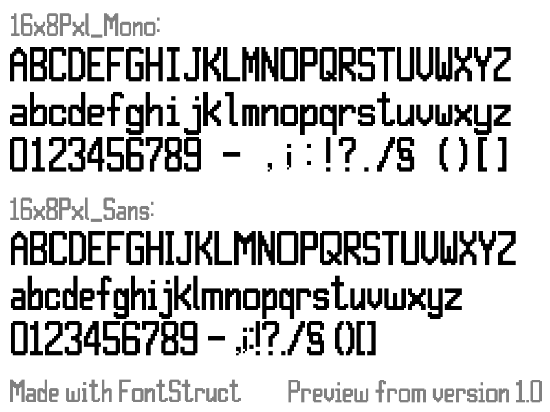

# 16x8Pxl

A simple 16px tall font I've made back in 2019. It's my 2nd font and the first one using Fontstruct.

## Supported glyphs

A total of **349** glyphs are supported:

* Basic Latin
* Greek

## How this font was made?

The font file in this archive was created using Fontstruct the free, online
font-building tool.

This font was created by “corne2plum3”.

This font has a homepage where this archive and other versions may be found:

* Mono: https://fontstruct.com/fontstructions/show/1676998
* Sans: https://fontstruct.com/fontstructions/show/1679464

Try Fontstruct at https://fontstruct.com
It’s easy and it’s fun.

Fontstruct is copyright ©2019-2025 Rob Meek

## Sources?

Fontstruct allows only to export the font as a file for GlyphApp, which I do not have as it's paid and only available on MacOS,
so I can't have a look at it. That's why they aren't available on this repo. If you want these sources files, contact me by mail
(see my [GitHub profile page](https://github.com/Corne2Plum3))

## Legal Notice

In using this font you must comply with the licensing terms described in the
file “LICENSE.txt” included with this archive.
If you redistribute the font file in this archive, it must be accompanied by all
the other files from this archive, including this one.
